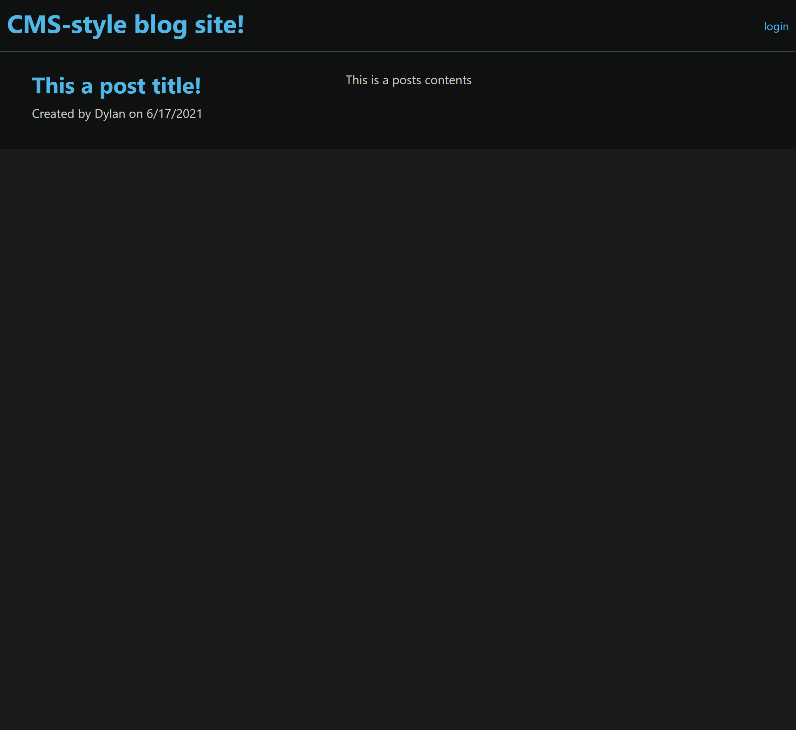
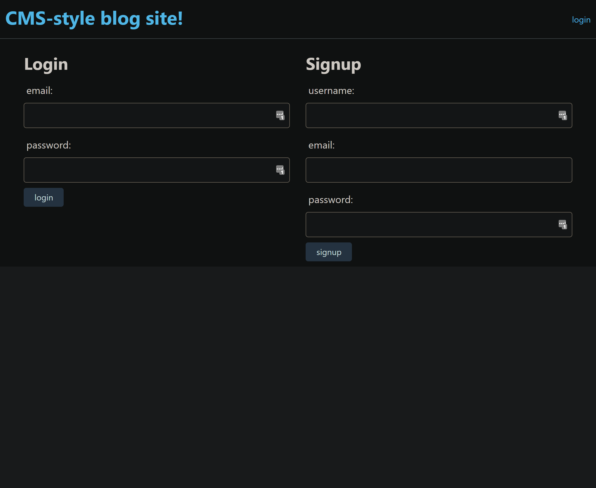
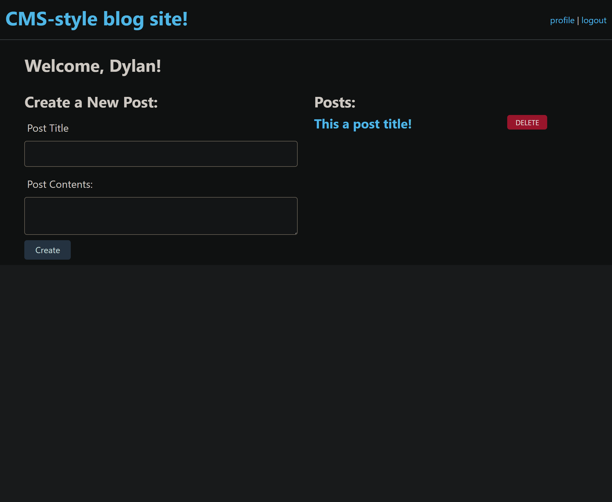
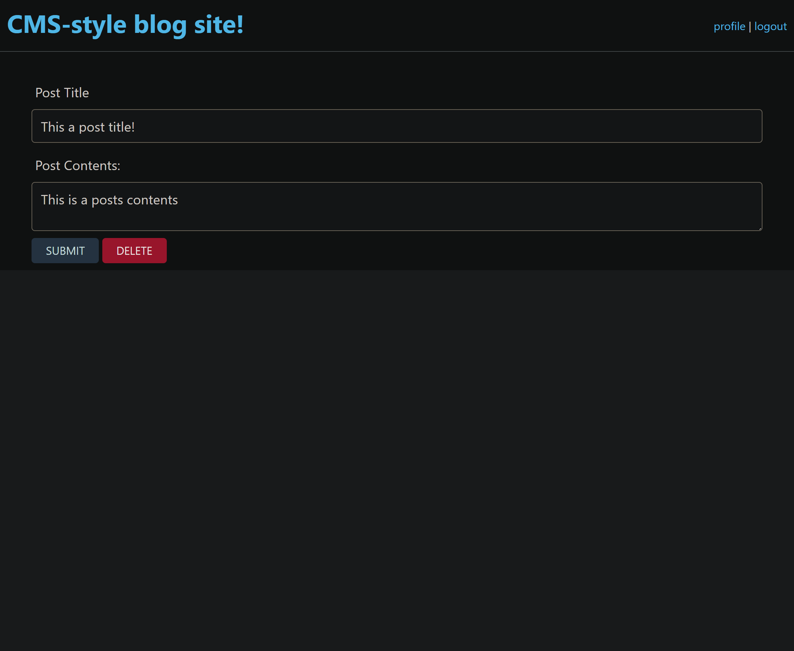
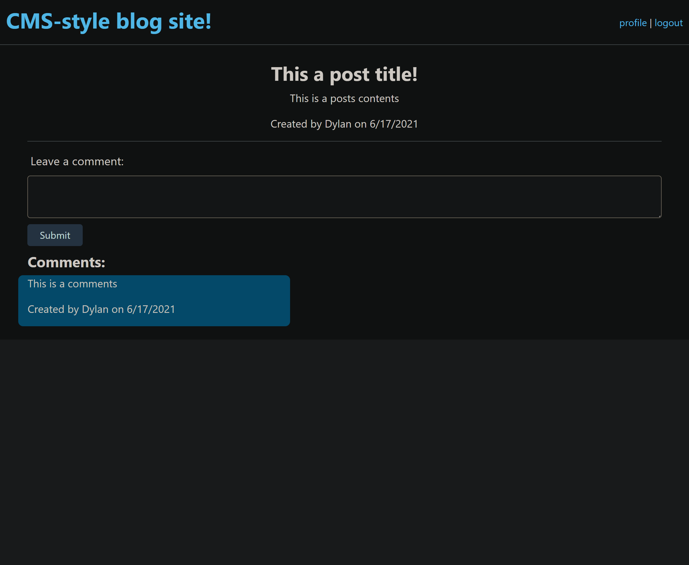

# 14-Model-View-Controller-MVC-Tech-Blog

## Table of contents
- [Description](#description)
- [Link to Deployed Application](#link-to-deployed-application)
- [Screenshots](#screenshots)
- [Contact](#contact) 
- [License](#license)

## Description

A CMS-style blog site similar to a Wordpress site, where developers can publish their blog posts and comment on other developers’ posts as well. Deployed to Heroku. It follows the MVC paradigm in its architectural structure, using Handlebars.js as the templating language, Sequelize as the ORM, and the express-session npm package for authentication.

##  Link to Deployed Application

https://mysterious-lowlands-86271.herokuapp.com/

## Screenshots

## Contact

### email

Dylan Cole <logboarddjc@gmail.com>

## License
 
MIT License

Copyright (c) [2021] [Dylan Cole]
